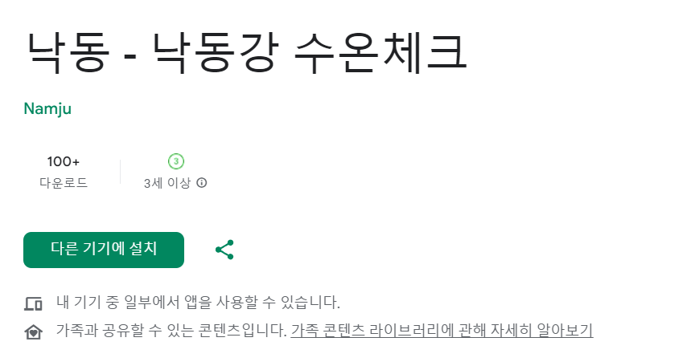

# 낙동 - 낙동강 수온 체크

|  |  |
| :-------------------------------: | :------------------------------------------: |

## ScreenShot

|            메인 화면             |             수심 변경             |                위치 변경                 |
| :------------------------------: | :-------------------------------: | :--------------------------------------: |
|  |  |  |

## App Build with

| Framework                                                                                                                |          How to use           |
| :----------------------------------------------------------------------------------------------------------------------- | :---------------------------: |
|  |       어플리케이션 개발       |
|                |       수온 데이터 저장        |
|  GitHub Action                         | 공공데이터로 부터 데이터 수집 |

# Update note

## ver 1.1

### Add Drawer

- 어플 설명, 저작권 표시 
- 문의하기 추가 
- 오픈소스라이선스 명시 
- 위치 변경 아이콘 Appbar action 탭으로 이동 

## ver 1.0

### Add 8 Point

- 하구둑8번교각 
- 하구둑10번교각 
- 갑문상류 
- 을숙도대교P3 
- 을숙도대교P20 
- 낙동강 하구둑 
- 낙동대교 
- 우안배수문 
